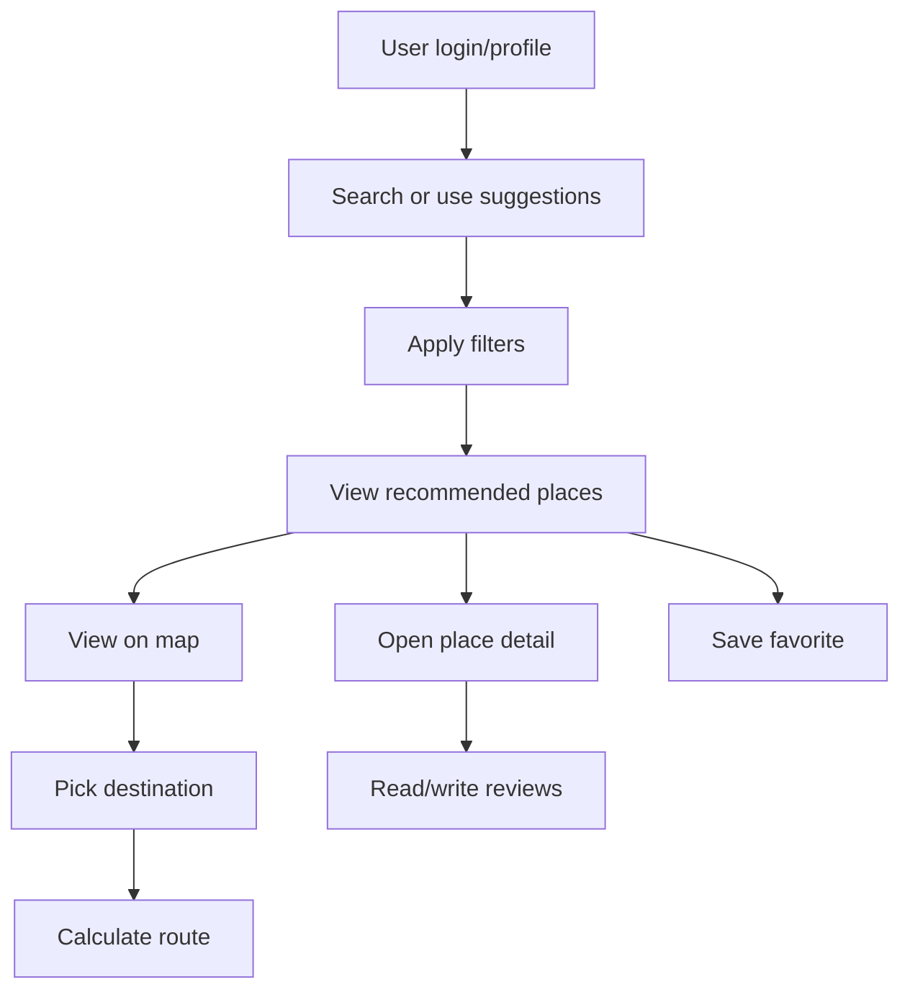
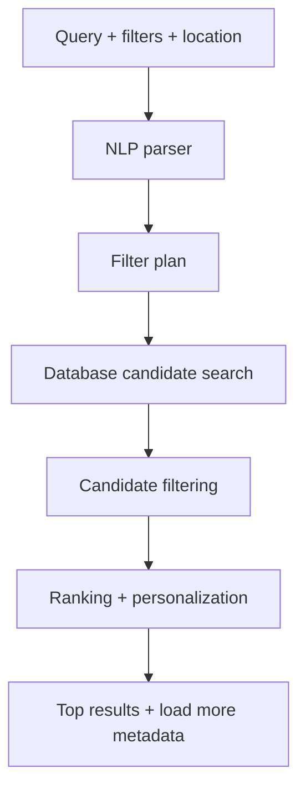
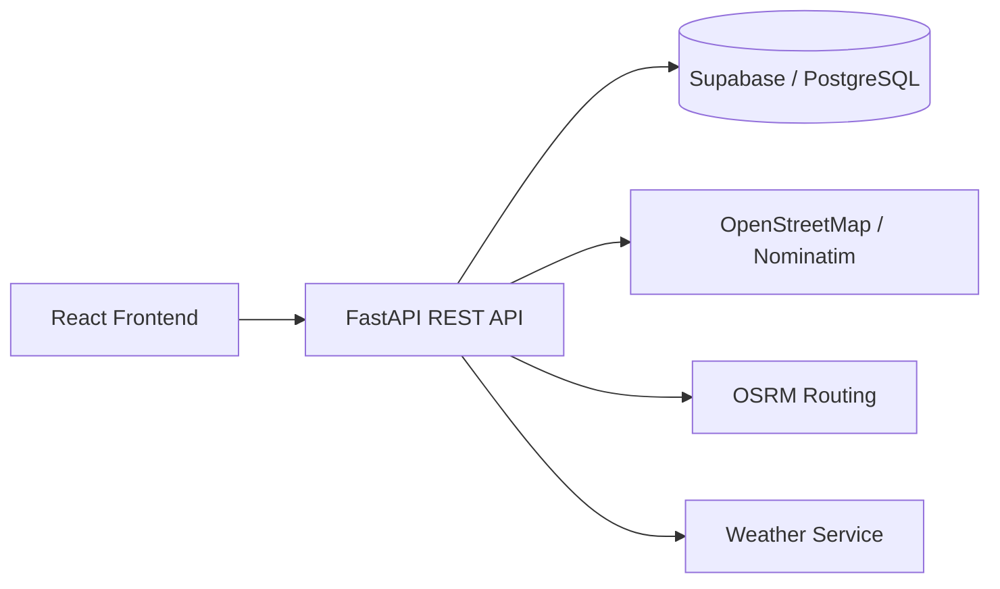
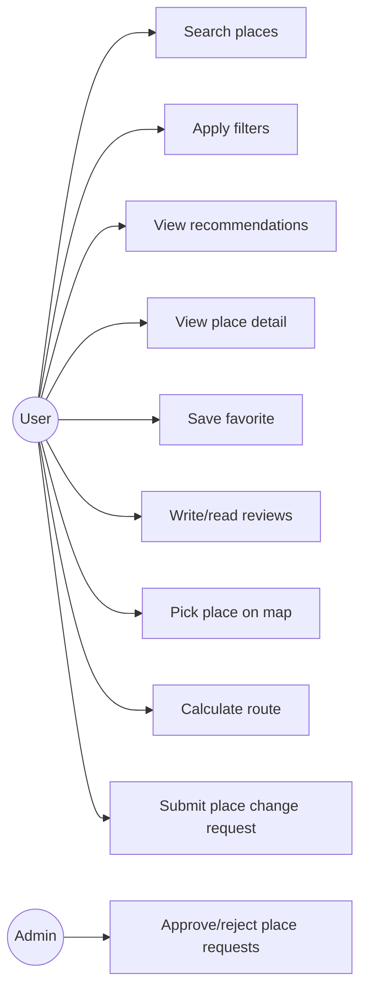
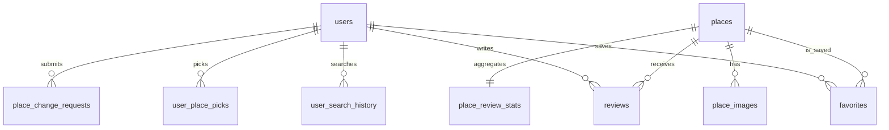

# Khung Báo Cáo Dự Án

> Tên dự án đề xuất: Hệ thống gợi ý du lịch thông minh ứng dụng tư duy tính toán
>
> Lưu ý: Đây là khung viết báo cáo. Các phần trong dấu `[Cần viết...]` là nội dung nhóm cần bổ sung bằng mô tả, hình chụp, số liệu test hoặc dẫn chứng từ code.

---

## Phân Công Và Tỷ Lệ Đóng Góp

> Nhóm cập nhật tên thật, MSSV và tỷ lệ cuối cùng theo mức đóng góp thực tế. Bảng dưới đây là tỷ lệ đề xuất để báo cáo có sẵn cấu trúc.

| Thành viên | Vai trò / module chính | Công việc đã thực hiện | Tỷ lệ đề xuất |
| --- | --- | --- | --- |
| Nhóm trưởng | Điều phối, tích hợp, kiểm thử | Chốt API contract, rà soát conflict giữa các nhánh, tách phạm vi file/hàm, merge code, kiểm thử build/test, cập nhật tài liệu phân công | 10% |
| TV1 | Backend recommendation API + search history | Thiết kế request/response contract cho `/recommendations`, lưu lịch sử tìm kiếm, giới hạn lịch sử gần nhất, schema API | 12% |
| TV2 | Frontend search/filter/result UI | Xây dựng Home search, FilterPanel, gọi recommendation API, hiển thị kết quả, load more, đồng bộ dữ liệu sang Map/Route | 14% |
| TV3 | NLP field extraction | Phân tích câu tự nhiên thành các trường filter như loại địa điểm, ngân sách, thời gian, nhóm đi cùng | 12% |
| TV4 | Candidate filtering | Lọc ứng viên theo query, category, rating, open now, khoảng cách và các filter từ UI/NLP | 12% |
| TV5 | Ranking + personalization | Tính điểm gợi ý, xếp hạng địa điểm, dùng lịch sử tìm kiếm/pick/favorite để cá nhân hóa | 16% |
| TV6 | Map pick to route | Tích hợp map, chọn marker/điểm trên bản đồ, chuyển địa điểm sang route, record pick history | 12% |
| TV7 | Review rating filter + incremental comments | Lọc bình luận theo số sao, ban đầu hiển thị 3 bình luận, nhấn mở rộng hiển thị thêm 10 bình luận mỗi lần | 12% |

### Công Việc Điều Phối Và Tích Hợp Của Nhóm

- Rà soát các điểm dễ conflict như `recommend_places`, `recommendations.py`, service frontend, review list.
- Tách phạm vi theo module để tránh nhiều thành viên sửa cùng một hàm lớn.
- Tách frontend service theo luồng: recommendation, map pick, place detail, review.
- Chuẩn hóa tên tọa độ theo `{ latitude, longitude }`.
- Chạy kiểm thử frontend build và backend tests sau khi tích hợp.
- Cập nhật sơ đồ `Struct.mmd`, `LuongXuLi.mmd` và tài liệu `TEAM_ASSIGNMENT.md`.

---

## Abstract / Tóm Tắt

> Độ dài mục tiêu: khoảng 1 trang.

[Cần viết đoạn tóm tắt gồm 4 ý sau:]

- **Bài toán:** Người dùng gặp khó khăn khi tìm địa điểm du lịch phù hợp, lọc thông tin từ nhiều nguồn, xem đánh giá và lựa chọn tuyến đường.
- **Giải pháp:** Hệ thống web gợi ý địa điểm du lịch thông minh dựa trên dữ liệu địa điểm, đánh giá, bộ lọc, lịch sử tìm kiếm và tương tác của người dùng.
- **Công nghệ:** Frontend React + Vite, backend FastAPI, database Supabase/PostgreSQL, bản đồ OpenStreetMap/Leaflet, geocoding Nominatim, routing OSRM, recommendation logic nội bộ.
- **Kết quả:** Hệ thống hỗ trợ tìm kiếm, lọc, xếp hạng gợi ý, xem chi tiết địa điểm, lưu yêu thích, xem route, lọc review và quản trị yêu cầu địa điểm.

Đoạn mẫu:

> Báo cáo trình bày quá trình xây dựng hệ thống gợi ý du lịch thông minh nhằm hỗ trợ người dùng tìm kiếm địa điểm phù hợp với nhu cầu cá nhân. Hệ thống áp dụng tư duy tính toán để trừu tượng hóa bài toán du lịch thành các thành phần như địa điểm, khoảng cách, đánh giá, bộ lọc và lịch sử tương tác. Dựa trên đó, nhóm triển khai ứng dụng web gồm frontend React, backend FastAPI và cơ sở dữ liệu Supabase/PostgreSQL. Hệ thống cung cấp các chức năng chính như tìm kiếm địa điểm, gợi ý cá nhân hóa, lọc kết quả, xem bản đồ, chọn điểm đến cho tuyến đường, quản lý yêu thích và lọc bình luận theo số sao. Kết quả cho thấy hệ thống có thể hỗ trợ người dùng ra quyết định nhanh hơn trong quá trình lập kế hoạch du lịch.

---

# Chapter 1 - Introduction

## 1.1 Background

[Cần trình bày:]

- Du lịch hiện đại phụ thuộc nhiều vào dữ liệu số: bản đồ, review, rating, hình ảnh, thời tiết, lịch trình.
- Người dùng thường phải chuyển qua nhiều ứng dụng để tìm địa điểm, xem đánh giá, lọc theo nhu cầu và tính tuyến đường.
- AI/recommendation system giúp cá nhân hóa trải nghiệm du lịch dựa trên sở thích, vị trí, lịch sử tương tác và ngữ cảnh.
- Smart tourism kết hợp dữ liệu, thuật toán và giao diện tương tác để hỗ trợ quyết định.

## 1.2 Problem Statement

[Cần nêu vấn đề cụ thể của dự án:]

- Người dùng khó chọn địa điểm phù hợp khi có nhiều lựa chọn trong database.
- Tìm kiếm văn bản đơn thuần chưa đủ vì người dùng còn cần lọc theo rating, khoảng cách, trạng thái mở cửa, loại địa điểm.
- Kết quả gợi ý cần được xếp hạng thay vì chỉ hiển thị ngẫu nhiên.
- Người dùng cần xem vị trí trên bản đồ và chuyển địa điểm thành điểm đến trong route.
- Review nhiều khiến việc đọc và đánh giá chất lượng địa điểm mất thời gian.

## 1.3 Objectives

Mục tiêu của dự án:

- Xây dựng ứng dụng web hỗ trợ gợi ý địa điểm du lịch.
- Cho phép người dùng tìm kiếm bằng từ khóa hoặc câu tự nhiên.
- Hỗ trợ lọc địa điểm theo loại, khoảng cách, rating, open now và ngân sách.
- Xếp hạng kết quả dựa trên điểm phù hợp và lịch sử tương tác.
- Hiển thị địa điểm trên bản đồ và hỗ trợ chọn điểm đến cho route.
- Hỗ trợ review, favorite, profile và admin workflow.
- Thể hiện rõ việc áp dụng Computational Thinking trong phân tích và thiết kế thuật toán.

## 1.4 Scope

### In Scope

- Đăng ký, đăng nhập, profile người dùng.
- Tìm kiếm và gợi ý địa điểm.
- Bộ lọc recommendation.
- Ranking và personalization ở mức rule-based/scoring.
- Bản đồ, marker, chọn địa điểm, route.
- Weather/context service nếu có dùng trong recommendation hoặc giao diện.
- Favorite places.
- Review và lọc review theo số sao.
- Admin duyệt yêu cầu thêm/sửa/xóa địa điểm.

### Out Of Scope

- Thanh toán.
- Booking khách sạn/vé/tour thật.
- Authentication cấp enterprise.
- Real-time traffic chính xác theo thời gian thực.
- Đồng bộ trực tiếp với Google Places trong runtime nếu hệ thống hiện dùng Supabase + OSM.
- Mobile native app.

## 1.5 Contributions

[Cần tóm tắt đóng góp kỹ thuật của hệ thống:]

- Thiết kế hệ thống full-stack cho bài toán smart tourism.
- Xây dựng recommendation pipeline gồm NLP parsing, filtering, ranking và personalization.
- Tích hợp bản đồ OpenStreetMap/Leaflet và route service OSRM.
- Thiết kế database cho users, places, reviews, favorites, search history, picks và admin requests.
- Tạo UI cho search, filter, result, map, route, detail, review và admin.
- Áp dụng decomposition để chia module rõ ràng, giảm conflict khi nhiều thành viên cùng phát triển.

---

# Chapter 2 - Related Work / Background

## 2.1 Smart Tourism

[Cần trình bày:]

- Khái niệm smart tourism.
- Mối liên hệ giữa smart city, dữ liệu địa điểm và trải nghiệm du lịch.
- Vai trò của bản đồ số, review, recommendation và dữ liệu thời tiết.

## 2.2 Recommendation Systems

[Cần trình bày các hướng phổ biến:]

- **Content-based filtering:** Gợi ý dựa trên thuộc tính địa điểm như category, rating, price, distance.
- **Collaborative filtering:** Gợi ý dựa trên hành vi của nhiều người dùng.
- **Hybrid recommendation:** Kết hợp nội dung, hành vi và ngữ cảnh.

[Liên hệ dự án:]

- Dự án hiện dùng hướng hybrid nhẹ: query/filter + scoring + lịch sử tìm kiếm/pick/favorite.

## 2.3 Route Optimization

[Cần trình bày:]

- Bài toán route có thể mô hình hóa bằng graph.
- Node là địa điểm hoặc tọa độ; edge là đường đi; weight là khoảng cách/thời gian.
- Các thuật toán nền tảng: Dijkstra, A*, TSP cơ bản.

[Liên hệ dự án:]

- Hệ thống dùng route service dựa trên OSRM để lấy tuyến đường thực tế giữa start và destination.

## 2.4 NLP And Context Understanding

[Cần trình bày:]

- NLP giúp chuyển câu tự nhiên thành các trường có cấu trúc.
- Ví dụ: "quán cafe yên tĩnh gần đây, rating cao" -> `category=cafe`, `min_rating`, `max_distance`.
- Trong dự án, module NLP parser hỗ trợ tiếng Việt có dấu/không dấu và một số từ khóa tiếng Anh.

---

# Chapter 3 - Computational Thinking Analysis

## 3.1 Problem Abstraction

| Thực tế | Trừu tượng trong hệ thống | Dữ liệu / biến tương ứng |
| --- | --- | --- |
| Địa điểm du lịch | Place / Node | `places.id`, `name`, `category`, `latitude`, `longitude` |
| Khoảng cách | Edge weight / distance | `distance_km`, route distance |
| Đánh giá người dùng | Text + rating data | `reviews.content`, `reviews.rating` |
| Sở thích người dùng | Preference vector / history | `favorites`, `user_search_history`, `user_place_picks` |
| Câu tìm kiếm tự nhiên | Structured filter | `query`, `preferred_types`, `min_rating`, `require_open_now` |
| Chọn địa điểm trên map | Coordinate selection | `{ latitude, longitude }` |

[Cần viết đoạn giải thích: Việc trừu tượng hóa giúp chuyển bài toán du lịch đời thực thành dữ liệu và thuật toán có thể xử lý.]

## 3.2 Decomposition

Hệ thống được tách thành các module:

```text
Travel Recommendation System
├── Authentication & Profile
├── Recommendation
│   ├── Request API
│   ├── NLP Field Extraction
│   ├── Candidate Filtering
│   └── Ranking & Personalization
├── Map & Route
├── Weather Context
├── Review & Rating
├── Favorite Places
└── Admin Place Request
```

[Cần trình bày:]

- Vì sao tách module giúp giảm độ phức tạp.
- Mỗi module có input/output rõ ràng.
- Liên hệ với `TEAM_ASSIGNMENT.md`: mỗi thành viên phụ trách một phần độc lập.

## 3.3 Pattern Recognition

[Cần nêu các mẫu dữ liệu/hành vi:]

- Người dùng tìm "cafe" thường quan tâm rating, khoảng cách và không gian.
- Người dùng đã favorite/pick nhiều địa điểm cùng category có khả năng thích category tương tự.
- Review rating cao thường làm tăng độ tin cậy của địa điểm.
- Nếu người dùng chọn filter `open_now`, kết quả cần ưu tiên địa điểm đang mở.
- Các địa điểm gần tọa độ hiện tại thường phù hợp hơn khi người dùng tìm "gần đây".

## 3.4 Algorithm Design

### 3.4.1 Recommendation Pipeline

```text
User query + filters + location
        |
        v
Parse NLP fields
        |
        v
Build filter plan
        |
        v
Search local database candidates
        |
        v
Apply candidate filtering
        |
        v
Score and rank places
        |
        v
Return top results + pagination metadata
```

[Cần mô tả input/output:]

- Input: query, filter, latitude, longitude, user history.
- Output: danh sách địa điểm đã xếp hạng, `score`, `explanation`, `has_more`, `next_offset`.

### 3.4.2 Scoring Formula

[Cần viết công thức đang dùng hoặc công thức mô tả:]

```text
final_score =
    w1 * text_match_score
  + w2 * rating_score
  + w3 * distance_score
  + w4 * preference_score
  + w5 * open_now_score
```

[Cần giải thích từng thành phần:]

- `text_match_score`: độ khớp giữa query/filter và thông tin địa điểm.
- `rating_score`: điểm dựa trên rating/review count.
- `distance_score`: ưu tiên địa điểm gần người dùng.
- `preference_score`: ưu tiên category từng favorite/pick/search.
- `open_now_score`: điểm cộng nếu đang mở cửa khi người dùng yêu cầu.

### 3.4.3 Review Filter Algorithm

[Cần mô tả logic TV7:]

```text
Input: reviews, selected_rating, visible_count
Filter reviews by selected_rating
Show first 3 reviews
When user clicks Load more:
    visible_count = visible_count + 10
Repeat until all filtered reviews are visible
```

### 3.4.4 Route Flow

[Cần mô tả:]

- Input: start point, destination point, travel mode.
- Backend/service gọi routing provider.
- Output: distance, duration, path polyline và step instruction.

## 3.5 Flowcharts

### User Flow



### Recommendation Flow



### API Flow



---

# Chapter 4 - System Design

## 4.1 Overall Architecture

```text
Frontend: React + Vite
        |
        v
Backend API: FastAPI
        |
        v
Database: Supabase / PostgreSQL
        |
        +--> Map data: OpenStreetMap / Nominatim
        +--> Routing: OSRM
        +--> Weather service
```

[Cần trình bày:]

- Frontend chịu trách nhiệm UI, state, routing, gọi API.
- Backend chịu trách nhiệm xác thực, business logic, recommendation, route, review, admin.
- Database lưu user, place, review, favorite, pick, search history.
- External services hỗ trợ geocoding, reverse geocoding, routing và weather.

## 4.2 Use Case Diagram

[Cần chèn hình use case hoặc dùng Mermaid:]



## 4.3 Database Design

### Main Tables

| Table | Purpose |
| --- | --- |
| `users` | Lưu thông tin người dùng |
| `places` | Lưu địa điểm du lịch, tọa độ, category, mô tả |
| `reviews` | Lưu bình luận và số sao |
| `favorites` | Lưu địa điểm yêu thích |
| `user_search_history` | Lưu lịch sử tìm kiếm phục vụ personalization |
| `user_place_picks` | Lưu địa điểm đã pick trên map/route |
| `place_review_stats` | Lưu thống kê rating theo địa điểm |
| `place_images` | Lưu ảnh địa điểm |
| `place_change_requests` | Lưu yêu cầu thêm/sửa/xóa địa điểm |
| `admins` | Quản lý quyền admin |

### ERD

[Cần chèn ERD từ Supabase hoặc vẽ lại bằng draw.io/Mermaid.]

Gợi ý Mermaid đơn giản:



## 4.4 API Design

| Method | Endpoint | Purpose | Input chính | Output chính |
| --- | --- | --- | --- | --- |
| `POST` | `/auth/register` | Đăng ký | user info | user/token |
| `POST` | `/auth/login` | Đăng nhập | username/password | access token |
| `GET` | `/recommendations` | Lấy gợi ý địa điểm | query, filters, latitude, longitude, limit, offset | items, has_more, next_offset |
| `POST` | `/recommendations/picks/{place_id}` | Ghi nhận user pick địa điểm | place_id | 204/no body |
| `GET` | `/places/{place_id}` | Xem chi tiết địa điểm | place_id | place detail |
| `POST` | `/places/resolve-point` | Resolve tọa độ thành địa điểm gần nhất | latitude, longitude | place-like object |
| `GET` | `/reviews/{place_id}` | Lấy review địa điểm | place_id, rating/limit nếu có | review list |
| `POST` | `/reviews/{place_id}` | Tạo review | rating, content | created review |
| `GET` | `/favorites` | Lấy favorite của user | token | favorite list |
| `POST` | `/favorites/{place_id}` | Lưu favorite | place_id | favorite item |
| `POST` | `/routes` | Tính route | origin, destination, travel_mode | distance, duration, path |
| `GET` | `/weather` | Lấy thời tiết | latitude, longitude | weather data |
| `GET` | `/admin/members` | Admin xem member | token admin | member list |

[Cần kiểm tra endpoint thật trước khi nộp và sửa bảng nếu có khác biệt.]

## 4.5 UI/UX Design

[Cần chèn screenshot/wireframe:]

- Home/search/recommendation results.
- Filter panel.
- Place detail page.
- Map page.
- Route planner.
- Review list with rating filter.
- Admin dashboard.

[Cần trình bày nguyên tắc UI:]

- Giao diện rõ ràng, ưu tiên thao tác tìm kiếm và lọc.
- Kết quả hiển thị dạng card dễ quét.
- Map và route hỗ trợ thao tác trực quan.
- Review được chia nhỏ bằng incremental loading để tránh quá tải thông tin.

---

# Chapter 5 - Implementation

## 5.1 Frontend

[Cần trình bày:]

- React + Vite.
- Routing bằng React Router.
- API services trong `frontend/src/services`.
- AppContext dùng chia sẻ `selectedPlace`, `currentLocation`, `recommendationPlaces`.
- Các page chính: Home, MapView, RouteView, PlaceDetail, Favorites, Profile, Admin.

Ví dụ cấu trúc:

```text
frontend/src
├── pages
├── components
├── services
├── hooks
├── context
└── utils
```

## 5.2 Backend

[Cần trình bày:]

- FastAPI làm REST API.
- SQLAlchemy repositories tách data access.
- Services chứa business logic: place search, routing, weather, upload.
- Recommendation module tách `nlp_parser.py`, `filters.py`, `ranking.py`, `recommender.py`.

Ví dụ cấu trúc:

```text
backend/app
├── api/routes
├── recommendation
├── repositories
├── services
├── schemas
├── models
└── tests
```

## 5.3 Recommendation Module

[Cần trình bày:]

- API nhận query/filter/location.
- NLP parser trích xuất field.
- Filter plan giới hạn candidates.
- Ranking tính điểm và sắp xếp.
- Search history/pick/favorite hỗ trợ personalization.
- Pagination/load more giúp người dùng xem thêm kết quả ngoài top đầu.

## 5.4 Route And Map Module

[Cần trình bày:]

- Leaflet hiển thị OpenStreetMap tiles.
- MarkerList hiển thị địa điểm từ recommendation/search/load more.
- Map pick resolve tọa độ sang địa điểm gần nhất hoặc điểm local.
- RouteView nhận start/destination và gọi route API.
- OSRM trả path, distance, duration.

## 5.5 Review Module

[Cần trình bày:]

- Review list hiển thị nội dung, rating và thời gian.
- Filter theo số sao.
- Ban đầu hiển thị 3 review.
- Mỗi lần nhấn mở rộng hiển thị thêm 10 review.
- Mục tiêu: giúp người dùng đọc review có kiểm soát, không bị quá tải.

## 5.6 Admin And Place Request Module

[Cần trình bày nếu demo có phần này:]

- User gửi yêu cầu thêm/sửa/xóa địa điểm.
- Có thể đính kèm ảnh.
- Admin duyệt hoặc từ chối.
- Kết quả giúp database cập nhật có kiểm soát.

## 5.7 External APIs / Services

| Service | Vai trò |
| --- | --- |
| OpenStreetMap / Leaflet | Hiển thị bản đồ |
| Nominatim | Geocoding / reverse geocoding |
| OSRM | Tính tuyến đường |
| Weather service | Cung cấp ngữ cảnh thời tiết |
| Supabase Storage | Lưu ảnh avatar/place/review nếu có dùng |

---

# Chapter 6 - Testing & Evaluation

## 6.1 Functional Testing

| Feature | Test case | Expected result | Actual result |
| --- | --- | --- | --- |
| Register/Login | Đăng ký và đăng nhập user mới | Token hợp lệ, vào được hệ thống | [Pass/Fail] |
| Recommendation | Search bằng query | Trả danh sách địa điểm phù hợp | [Pass/Fail] |
| Filter | Lọc theo rating/open now/distance | Kết quả thỏa điều kiện | [Pass/Fail] |
| Load more | Nhấn Load more | Tải thêm địa điểm, không duplicate | [Pass/Fail] |
| Map | Mở Map sau khi search/load more | Marker hiển thị đủ địa điểm đã tải | [Pass/Fail] |
| Route | Chọn start/destination và tính route | Hiển thị distance, duration, path | [Pass/Fail] |
| Review filter | Chọn số sao | Chỉ hiện review đúng rating | [Pass/Fail] |
| Admin | Approve/reject request | Trạng thái request cập nhật đúng | [Pass/Fail] |

## 6.2 Performance

[Cần đo hoặc ước lượng có dẫn chứng:]

| Metric | Cách đo | Kết quả |
| --- | --- | --- |
| Recommendation response time | DevTools/API log | [Cần điền] |
| Frontend build time | `npm run build` | [Cần điền] |
| Backend test time | `pytest backend/app/tests` | [Cần điền] |
| Số địa điểm trong database | Query database | [Cần điền] |

## 6.3 Accuracy / Quality

[Cần trình bày cách đánh giá chất lượng gợi ý:]

- Kiểm tra thủ công các query mẫu: cafe, restaurant, museum, park.
- So sánh kết quả trước/sau filter.
- Đánh giá xem kết quả có đúng category, gần vị trí, rating phù hợp không.
- Lấy feedback từ thành viên nhóm hoặc người dùng thử.

## 6.4 Limitations

- Recommendation còn phụ thuộc chất lượng dữ liệu trong database.
- Personalization ở mức rule-based/scoring, chưa phải mô hình học máy phức tạp.
- Chưa có real-time traffic.
- Một số địa điểm có thể thiếu ảnh, giờ mở cửa hoặc tọa độ.
- Chưa có booking/payment thật.
- NLP còn giới hạn trong tập từ khóa được định nghĩa.

---

# Chapter 7 - Conclusion And Future Work

## 7.1 Conclusion

[Cần tóm tắt:]

- Hệ thống đã triển khai được ứng dụng full-stack cho bài toán gợi ý du lịch.
- Các module chính gồm search/filter, recommendation ranking, map/route, review, favorite và admin.
- Dự án thể hiện rõ Computational Thinking qua abstraction, decomposition, pattern recognition và algorithm design.
- Hệ thống có thể hỗ trợ người dùng tìm địa điểm và lập kế hoạch di chuyển nhanh hơn.

## 7.2 Future Work

Hướng phát triển:

- Cá nhân hóa tốt hơn bằng machine learning hoặc embedding similarity.
- Tối ưu route nhiều điểm theo TSP/VRP.
- Tích hợp traffic/time-aware routing.
- Hỗ trợ đa ngôn ngữ tốt hơn.
- Gợi ý lịch trình theo ngày, ngân sách và thời tiết.
- Thêm dashboard analytics cho admin.
- Tối ưu performance khi database lớn bằng indexing, full-text search và caching.

---

# References

> Chọn IEEE hoặc APA và thống nhất toàn báo cáo.

Gợi ý nguồn tham khảo:

1. FastAPI Documentation. https://fastapi.tiangolo.com/
2. React Documentation. https://react.dev/
3. Vite Documentation. https://vite.dev/
4. Leaflet Documentation. https://leafletjs.com/
5. OpenStreetMap. https://www.openstreetmap.org/
6. Nominatim Documentation. https://nominatim.org/
7. OSRM Documentation. https://project-osrm.org/
8. Supabase Documentation. https://supabase.com/docs
9. Ricci, F., Rokach, L., & Shapira, B. Recommender Systems Handbook.
10. Buhalis, D., & Amaranggana, A. Smart Tourism Destinations.

---

# Appendix

## Appendix A - Source Code Snippets

[Cần chèn các đoạn code ngắn quan trọng:]

- Recommendation scoring.
- Filter plan.
- Review filter/load more.
- Route request/response.

## Appendix B - API Examples

Ví dụ recommendation request:

```http
GET /api/v1/recommendations?query=cafe&latitude=10.7769&longitude=106.7009&min_rating=4&limit=10&offset=0
```

Ví dụ response rút gọn:

```json
{
  "items": [
    {
      "id": 1,
      "name": "Example Cafe",
      "address": "Ho Chi Minh City",
      "latitude": 10.7769,
      "longitude": 106.7009,
      "rating": 4.5,
      "score": 8.7
    }
  ],
  "limit": 10,
  "offset": 0,
  "has_more": true,
  "next_offset": 10
}
```

## Appendix C - Screenshots

[Cần chèn ảnh:]

- Home search.
- Filter panel.
- Recommendation results.
- Place detail.
- Map markers.
- Route planner.
- Review filter.
- Admin page.

## Appendix D - Diagrams

- `Struct.mmd`: sơ đồ cấu trúc module.
- `LuongXuLi.mmd`: sơ đồ luồng xử lý.
- ERD database.
