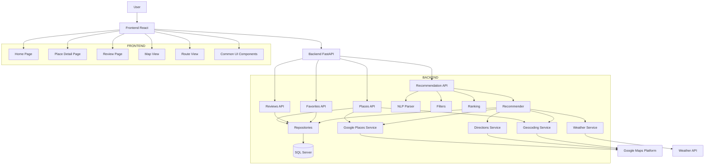

```mermaid
flowchart TD
    U[User] --> FE[Frontend React]

    subgraph FRONTEND
        FE1[Home Page]
        FE2[Place Detail Page]
        FE3[Review Page]
        FE4[Map View]
        FE5[Route View]
        FE6[Common UI Components]
    end

    FE --> FE1
    FE --> FE2
    FE --> FE3
    FE --> FE4
    FE --> FE5
    FE --> FE6

    FE --> API[Backend FastAPI]

    subgraph BACKEND
        R1[Places API]
        R2[Reviews API]
        R3[Favorites API]
        R4[Recommendation API]

        S1[Google Places Service]
        S2[Directions Service]
        S3[Geocoding Service]
        S4[Weather Service]

        A1[NLP Parser]
        A2[Filters]
        A3[Ranking]
        A4[Recommender]

        DBR[Repositories]
        DBS[(SQL Server)]
    end

    API --> R1
    API --> R2
    API --> R3
    API --> R4

    R1 --> S1
    R1 --> S3
    R1 --> DBR

    R2 --> DBR
    R3 --> DBR

    R4 --> A1
    R4 --> A2
    R4 --> A3
    R4 --> A4

    A4 --> S1
    A4 --> S2
    A4 --> S3
    A4 --> S4
    A4 --> DBR

    DBR --> DBS

    S1 --> GMP[Google Maps Platform]
    S2 --> GMP
    S3 --> GMP
    S4 --> WAPI[Weather API]
```