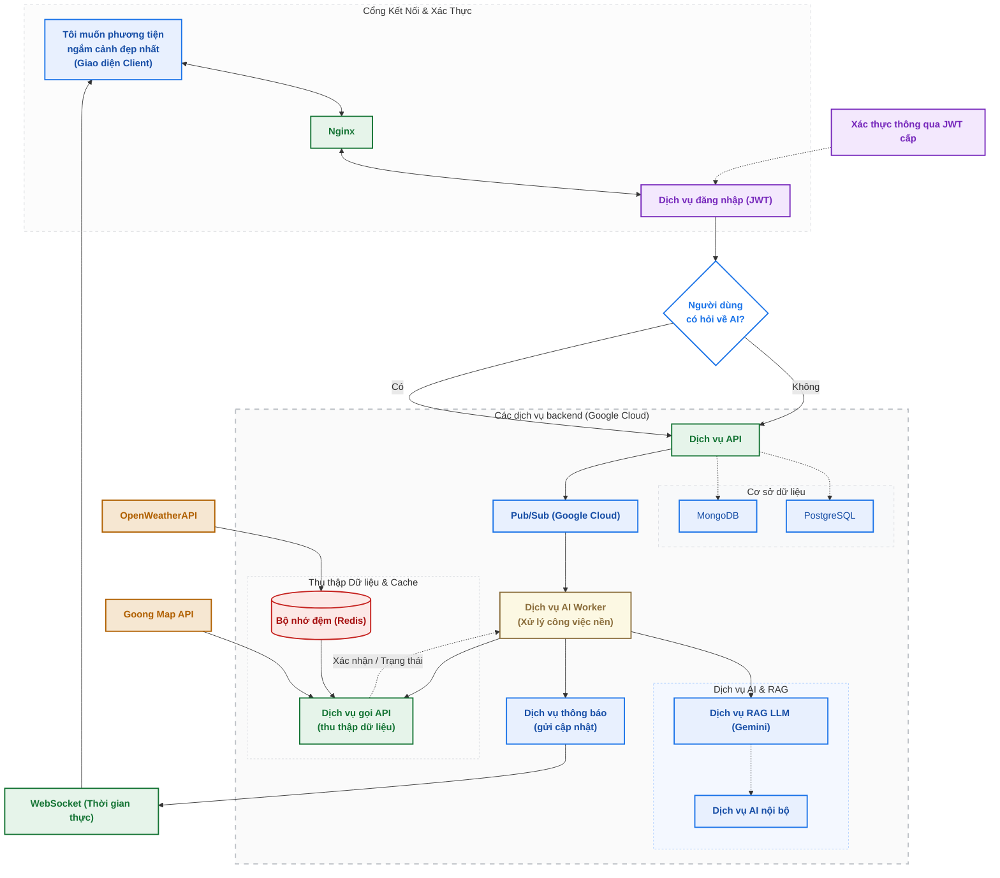

# Sơ đồ Kiến trúc & Luồng xử lý Hệ thống (System Architecture & Flowchart)

Tài liệu này mô tả chi tiết kiến trúc hệ thống và luồng dữ liệu của dự án gợi ý phương tiện và địa điểm ngắm cảnh (được xây dựng tương ứng theo sơ đồ thiết kế hệ thống trên Google Cloud).

---

## 1. Sơ đồ luồng (Flowchart) bằng Mermaid

Dưới đây là sơ đồ luồng hệ thống được mô tả bằng cú pháp Mermaid. Bạn có thể xem trực tiếp hoặc render qua các công cụ hỗ trợ Mermaid (như extension trên VS Code, GitHub, hoặc các trang render online).

---

## 2. Giải thích Chi tiết các Thành phần Hệ thống

Hệ thống được thiết kế theo kiến trúc hướng sự kiện (Event-driven Architecture) kết hợp xử lý song song và bất đồng bộ để đáp ứng các tác vụ AI nặng mà không gây nghẽn luồng chính.

### A. Nhóm Biên (Edge & Authentication)
*   **Giao diện Client**: Nơi người dùng nhập các yêu cầu như *"Tôi muốn phương tiện ngắm cảnh đẹp nhất"*. Nhận kết quả trực tiếp từ API đồng bộ hoặc thông báo real-time từ cổng WebSocket.
*   **Nginx**: Reverse Proxy đóng vai trò định tuyến các yêu cầu từ Client đến các dịch vụ tương ứng ở backend.
*   **Dịch vụ đăng nhập (JWT)**: Quản lý phiên làm việc, cấp phát token JWT bảo mật.
*   **Xác thực người dùng**: Dịch vụ nền chạy bất đồng bộ để kiểm tra tính hợp lệ của token JWT được gửi từ client.

### B. Nhóm Dịch vụ Backend chính (Google Cloud)
*   **Dịch vụ API**: Cổng API tiếp nhận mọi request nghiệp vụ.
    *   *Cơ sở dữ liệu (PostgreSQL & MongoDB)*: Lưu trữ dữ liệu có cấu trúc (thông tin người dùng, lịch sử tìm kiếm) và dữ liệu phi cấu trúc (thông tin địa điểm, review). Dữ liệu được đồng bộ/truy xuất bất đồng bộ qua API chính.
*   **Pub/Sub (Google Cloud)**: Message Queue trung gian tiếp nhận các thông điệp yêu cầu xử lý từ Dịch vụ API và đẩy cho các Worker xử lý. Giúp giảm tải cho API chính khi có các yêu cầu tính toán AI phức tạp.
*   **Dịch vụ AI Worker**: Xử lý các tác vụ nền nhận từ Pub/Sub. Worker sẽ điều phối việc gọi RAG LLM và thu thập dữ liệu bổ sung để phản hồi cho người dùng.
*   **Dịch vụ RAG LLM (Gemini) & Dịch vụ AI nội bộ**: Kết hợp mô hình ngôn ngữ lớn (Gemini) với kho tri thức nội bộ để tạo ra câu trả lời được tối ưu hóa cho bài toán gợi ý lộ trình/phương tiện.
*   **Dịch vụ gọi API (Thu thập dữ liệu) & Redis**:
    *   Gọi các API bên ngoài như **OpenWeatherAPI** (dự báo thời tiết) và **Goong Map API** (tìm đường, địa lý).
    *   **Bộ nhớ đệm (Redis)**: Cache dữ liệu thời tiết (từ OpenWeatherAPI) giúp tối ưu thời gian gọi API ngoài và tiết kiệm chi phí.
*   **Dịch vụ thông báo (Gửi cập nhật)**: Nhận kết quả từ AI Worker sau khi hoàn thành và đẩy xuống cổng WebSocket.

### C. Giao thức Thời gian thực
*   **WebSocket**: Duy trì kết nối hai chiều liên tục giữa Client và Backend. Khi AI Worker xử lý xong yêu cầu bất đồng bộ, kết quả sẽ ngay lập tức được đẩy về Client qua kênh này mà Client không cần thực hiện cơ chế gửi yêu cầu liên tục (Polling).

---

## 3. Luồng hoạt động chính (Execution Flows)

### 3.1. Luồng Đồng bộ (Synchronous Flow - Khi KHÔNG hỏi về AI)
1.  Client gửi yêu cầu (qua Nginx) đến **Dịch vụ đăng nhập (JWT)** để kiểm tra quyền truy cập.
2.  Sau khi xác thực thành công, hệ thống kiểm tra câu hỏi. Nếu **Không** liên quan đến AI (ví dụ: xem danh sách yêu thích, cấu hình tài khoản):
3.  **Dịch vụ API** sẽ truy vấn trực tiếp vào **PostgreSQL / MongoDB** và trả kết quả đồng bộ ngay lập tức về Client qua Nginx.

### 3.2. Luồng Bất đồng bộ (Asynchronous Flow - Khi CÓ hỏi về AI)
1.  Người dùng gửi câu hỏi liên quan đến gợi ý phương tiện hoặc lộ trình ngắm cảnh.
2.  Hệ thống đi qua bước xác thực JWT.
3.  Bộ điều hướng phát hiện câu hỏi thuộc nhóm **AI**, chuyển yêu cầu đến **Dịch vụ API**.
4.  **Dịch vụ API** đẩy một message (sự kiện) vào **Pub/Sub (Google Cloud)** và phản hồi ngay lập tức cho Client rằng *"Yêu cầu đang được xử lý"*.
5.  **Dịch vụ AI Worker** tiêu thụ (consume) message từ **Pub/Sub**:
    *   Worker gọi **Dịch vụ RAG LLM (Gemini)** kết hợp tri thức từ **Dịch vụ AI nội bộ**.
    *   Đồng thời, Worker kích hoạt **Dịch vụ gọi API** để thu thập dữ liệu thực tế (thời tiết từ **OpenWeatherAPI** - có cache qua **Redis**, và bản đồ từ **Goong Map API**).
    *   Dữ liệu thu thập được trả về cho Worker để tổng hợp vào prompt hoặc ngữ cảnh RAG.
6.  Sau khi hoàn tất tổng hợp và có kết quả gợi ý tối ưu nhất, **AI Worker** gửi kết quả đến **Dịch vụ thông báo**.
7.  **Dịch vụ thông báo** đẩy dữ liệu qua cổng **WebSocket** để cập nhật trực tiếp lên màn hình của **Client** theo thời gian thực.
